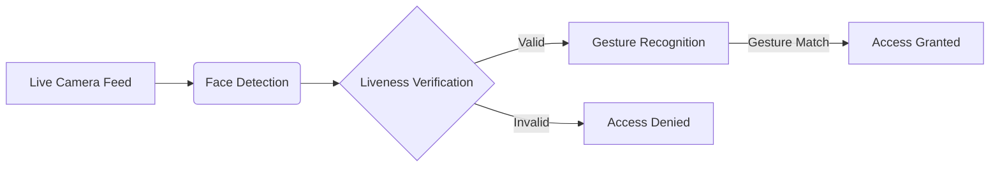

# 🔒 AI Face Authentication System


---

## 📌 Overview

An advanced AI-powered authentication system that ensures secure identity verification through:

- ✅ Face recognition  
- ✅ Anti-spoofing (liveness detection)  
- ✅ Hand gesture validation  
- ✅ Real-time decision pipeline  

---

## 🎯 Key Features

| Module           | Functionality                                |
|------------------|----------------------------------------------|
| **Face ID**       | 128D facial encoding for identity matching   |
| **Liveness Check**| YOLO-based spoof detection (photo/video)     |
| **Gesture Auth**  | Hand sign recognition for secondary check    |
| **Session Logs**  | Encrypted and timestamped activity tracking  |

---

## ⚙️ Tech Stack

**Computer Vision**  
```python
OpenCV · MediaPipe · face_recognition
```

**AI & Deep Learning**  
```python
YOLOv5 · Ultralytics
```

**UI & Utilities**  
```python
Streamlit · JSON · pyttsx3
```

---

## 📁 Project Structure

```
FaceAuth/
├── assets/
│   ├── model.pt            # YOLOv5 anti-spoofing model
│   └── login_anim.json     # Lottie animation asset
│
├── user_data/
│   └── profiles.json       # Encrypted user profile data
│
├── main_app.py             # Streamlit app entry point
├── auth_module.py          # Core authentication logic
└── requirements.txt        # Python dependencies
```

---

## 🛠️ Installation

```bash
git clone https://github.com/YOUR_USERNAME/FaceAuth.git
cd FaceAuth
pip install -r requirements.txt
streamlit run main_app.py
```

---

## 🖥️ How to Use

### 🔐 User Enrollment

1. Position your face within the camera frame  
2. Pass the liveness check (anti-spoofing)  
3. Register a hand gesture for verification  

### 🔄 Authentication Flow



---

## 🚀 Roadmap

- [x] Face recognition-based login  
- [x] YOLO liveness check  
- [x] Gesture verification  
- [ ] Multi-user account support  
- [ ] Mobile app integration (Android/iOS)  
- [ ] Voice-based authentication  

---

## 🤝 Contribution Guide

1. Fork this repository  
2. Create a new branch: `feature/your-feature-name`  
3. Commit your changes with:  
   - Clear documentation  
   - Relevant test cases  
   - Sample input/output if applicable  
4. Open a Pull Request  

---

## 📄 License

This project is licensed under the MIT License.  
See the full license details in the [LICENSE](LICENSE) file.


